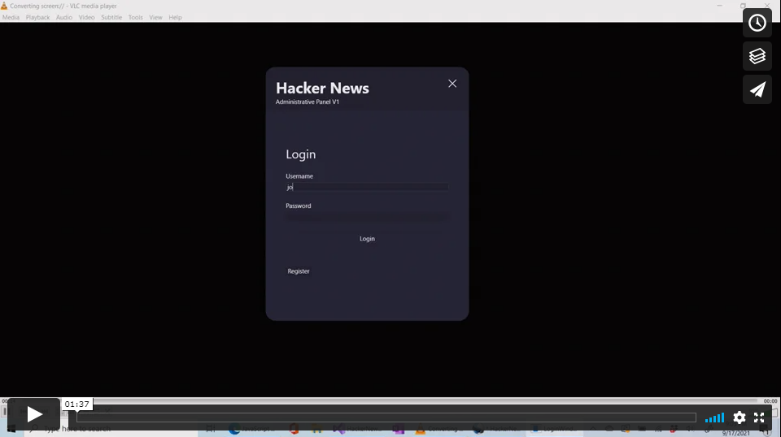

# HackerNews

HackerNews is a social media site similar to [Reddit](https://www.reddit.com) and [Y Combinator's HackerNews](https://news.ycombinator.com/).
Users can enjoy all the functionality expected of social media these days such as creating and viewing other users'
posts from a convenient website interface.

### Sub Projects

HackerNews is more than just a website; it is a full-stack app that really consists of many subprojects, including

-   a website rendered server-side with [ASP.NET MVC](https://dotnet.microsoft.com/apps/aspnet/mvc)
-   a desktop app built with [Windows Presentation Foundation (WPF)](https://docs.microsoft.com/en-us/dotnet/desktop/wpf/overview/)
-   a REST API backend built with [ASP.NET Web API](https://dotnet.microsoft.com/apps/aspnet/apis)
-   a command-line interface (CLI) tool used to interact with the REST API from the console

### Key Features

-   secure register and login functionality
-   persistence to a database
-   ability for users to create, view, update, and delete boards, posts, and comments
-   ability for users to upvote, downvote, and save other users' content
-   clean and modular solution architecture
-   unit and integration tests to ensure functional correctness

## Website Video Demo

## Desktop App Video Demo

